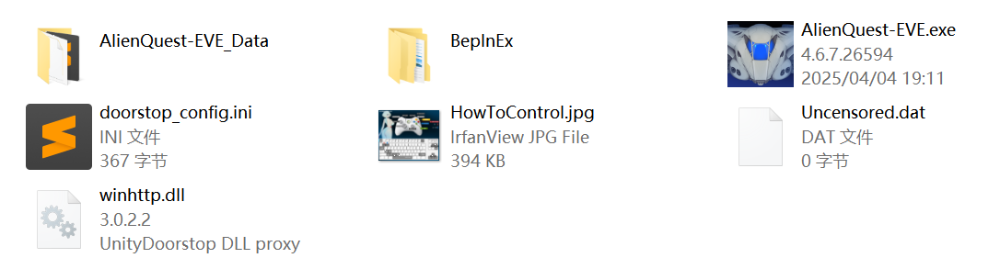
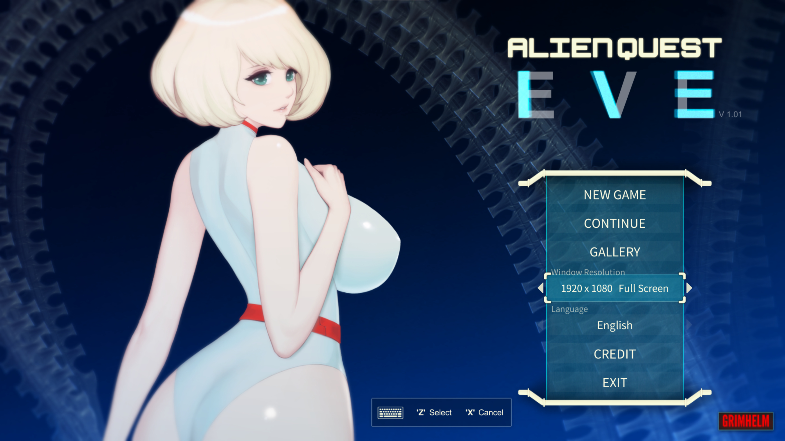
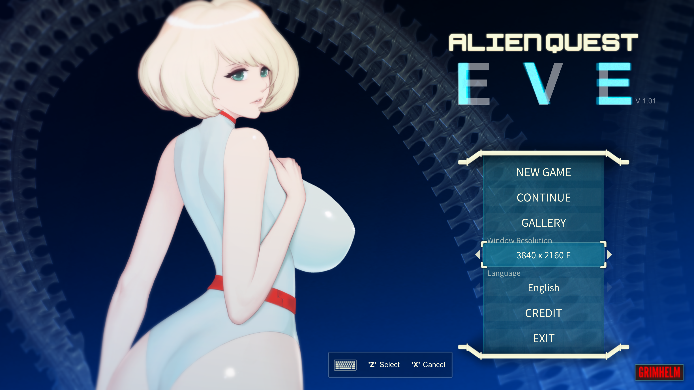
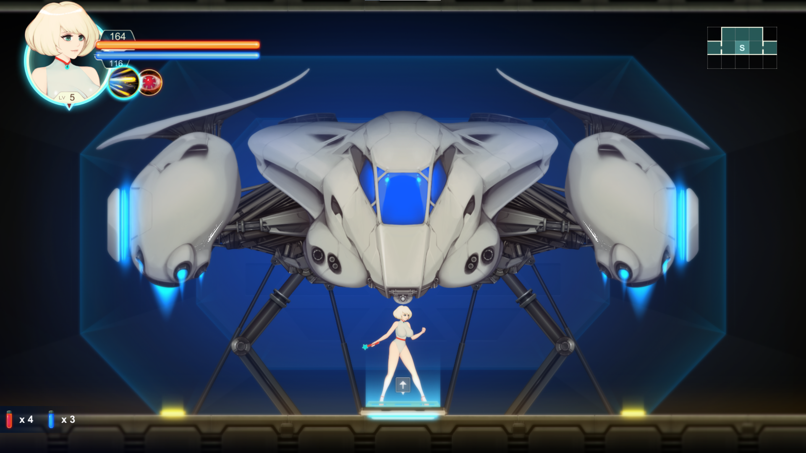
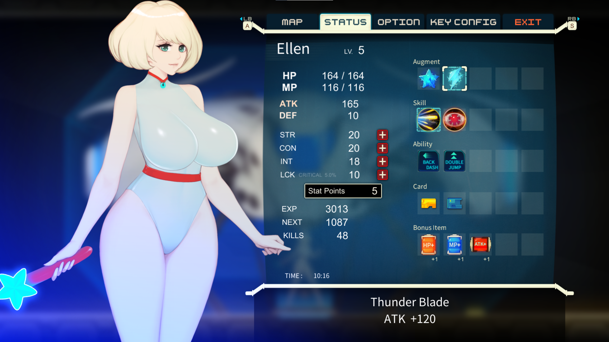
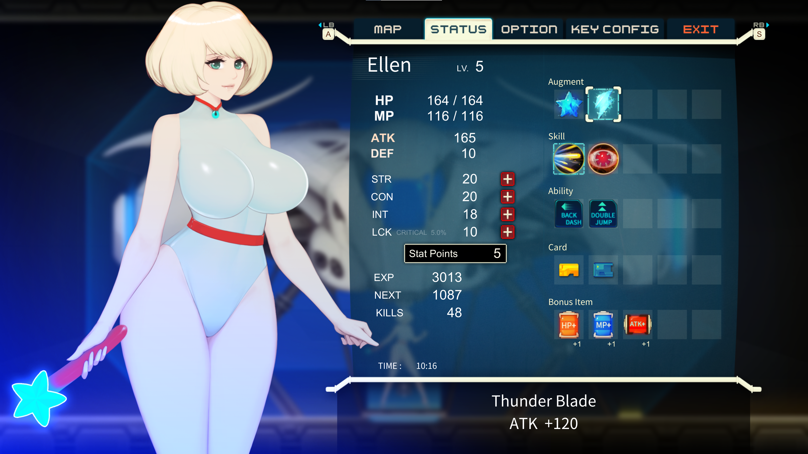
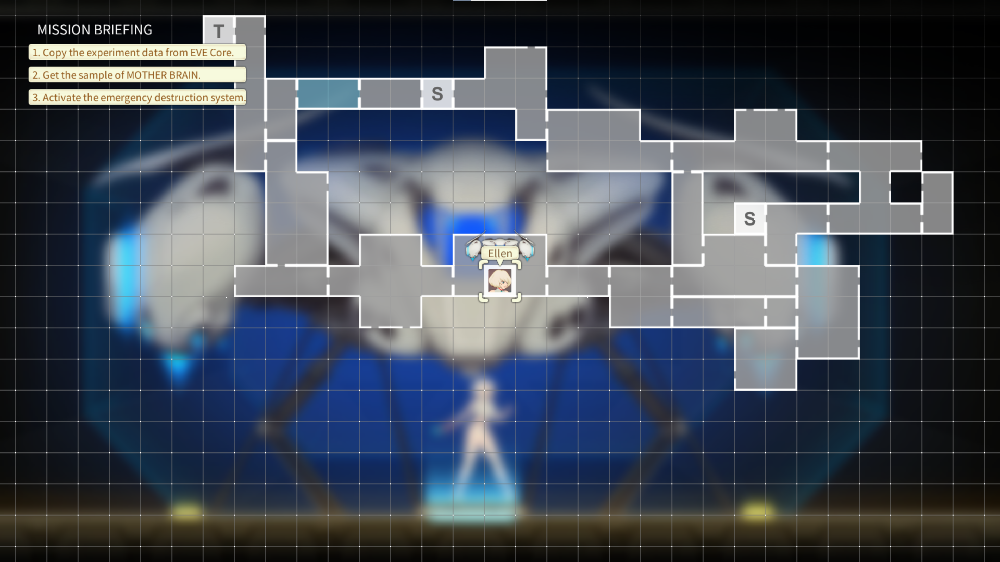
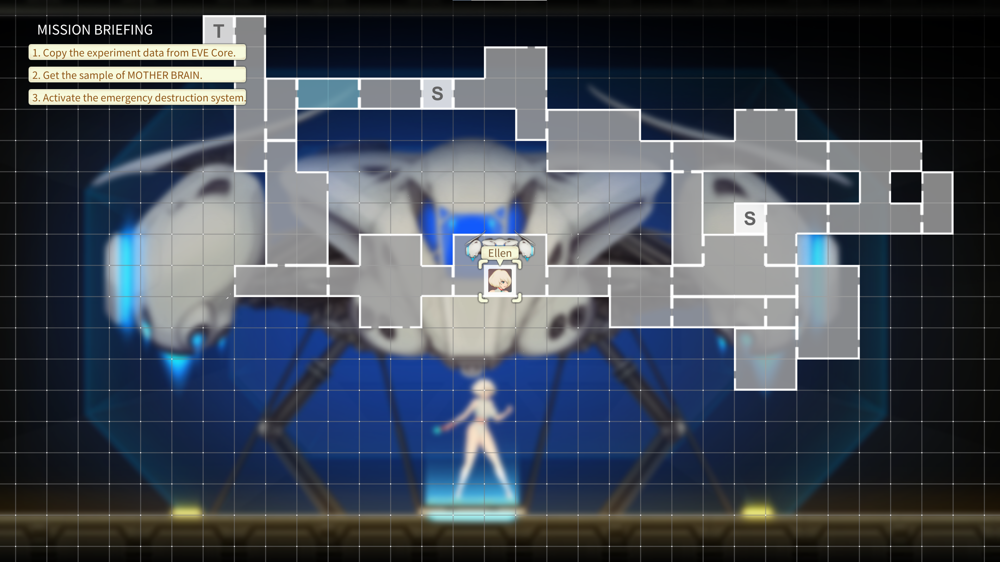

## AQE Enhanced

### Info

**Alien Quest: EVE** 4K or higher resolution UI (and smoother fps) mod.

### Usage

1. Dwonload .zip from release.
2. Extract to game root folder, should looks like this.
   
3. Press F7 to force set game window to 80% W/H Windowed Mode.
4. Press f8 to force set game window to Borderless FullScreen Mode.

#### Known Issue

Windowed Mode flickering while "Back to Main Title".

### Preview

Title Before / After

UI Before / After

Menu Before / After

Map Before / After

### Disclaimer

I know nothing about game programming, C#, .NET or Unity Engine. I made this for self-use.

This is just a Proof of concept that you can run AQE on higher UI resolution without changing game mechanics.

Use code from [BonedMod](https://f95zone.to/threads/alien-quest-eve-v1-01-grimhelm.6016/post-3630740).

### About AQE

- Press F1 to unlock all gellery scenes.
- Game configs saved to registry `HKEY_CURRENT_USER\SOFTWARE\GRIMHELM\AQEv1.0`
- Game saves saved to game root directory.
